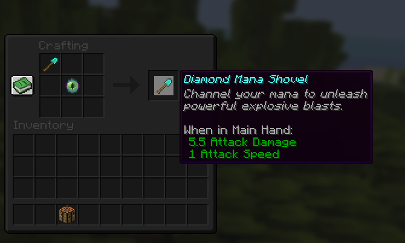

# ⚒️ Llyod Slaves


A Minecraft Paper RPG plugin inspired by The Greatest Estate Developer.

Cultivate mana, forge Mana Hearts, unlock Mana Circles, survive Mana Overload, and become a true master of mana.

---

# Screenshots

## Mana System


Shows:

* Current Mana
* Mana Capacity
* Rank
* Circle
* Heart Stage

---

## Mana Blast


Launch powerful mana-infused blasts using your Mana Shovel.

* Explosive projectiles
* Scales with Heart Stage
* Consumes mana
* Causes backlash if your heart is weak

---

## Mana Heart Progression

Upgrade your Mana Heart through multiple stages.

Heart Stages:

* Stage I
* Stage II
* Stage III

Higher stages provide:

* More blast power
* Larger explosion radius
* Reduced backlash damage

---

## Mana Circle Progression


Advance your cultivation.

Circles:

* Circle I
* Circle II
* Circle III
* Circle IV
* Circle V

Benefits:

* Increased meditation efficiency
* Increased mana gain
* Extra health
* Stronger abilities

---

## Meditation


Recover and cultivate mana while remaining still.

Features:

* Passive mana generation
* Circle bonuses
* Visual effects
* Interrupts on movement

---

## Mana Overload


Push beyond your limits.

When mana exceeds capacity:

* Mana bar changes color
* Nausea effects begin
* Damage over time occurs
* Players must spend excess mana

---

## Lloyd Build Mode


Inspired by The Greatest Estate Developer.

Gain temporary building buffs:

* Haste
* Speed
* Jump Boost

Perfect for large construction projects.

---

## Mana Shovel



Craft a Mana Shovel to unlock mana abilities.

Recipe:

Shovel + Eye Of Ender

Supported:

* Wooden Shovel
* Stone Shovel
* Iron Shovel
* Golden Shovel
* Diamond Shovel

Special Netherite Mana Shovel is admin-only.

---

# Features

## Mana System

* Persistent player mana
* Mana capacity upgrades
* Visual mana bar
* Mana ranks
* Mana overload mechanics

## Mana Hearts

* Stage I
* Stage II
* Stage III

Provides:

* Damage scaling
* Radius scaling
* Backlash protection

## Mana Circles

* Circle I
* Circle II
* Circle III
* Circle IV
* Circle V

Unlocks:

* Extra hearts
* Better cultivation
* Improved mana control

## Meditation

Use:

```bash
/llyod meditate
```

Remain still to cultivate mana.

## Mana Blast

Use a Mana Shovel and right-click.

Consumes mana to launch an explosive projectile.

## Lloyd Build Mode

Use:

```bash
/llyod build
```

Receive temporary building-focused buffs.

---

# Commands

## Player Commands

```bash
/llyod help
/llyod mana stats
/llyod meditate
/llyod build
/llyod heart next
/llyod heart upgrade
/llyod circle upgrade
/llyod capacity upgrade
/llyod boost speed
/llyod boost resistance
/llyod boost vision
/llyod boost strength
```

## Admin Commands

```bash
/llyod give mana <player> <amount>
/llyod set mana <player> <amount>
/llyod reset mana <player>
/llyod give heart <player> <stage>
/llyod give circle <player> <stage>
/llyod reload
/llyod manashovel give <player>
```

---

# Permissions

```bash
llyodslaves.use
llyodslaves.admin
```

---

# Requirements

* Paper 1.21+
* Java 21

---

# Installation

1. Download the plugin.
2. Place the jar into your plugins folder.
3. Start the server.
4. Configure config.yml.
5. Restart the server.

---

# Inspired By

The Greatest Estate Developer

This plugin is a fan-made RPG progression system inspired by cultivation, mana growth, and construction-focused progression.
